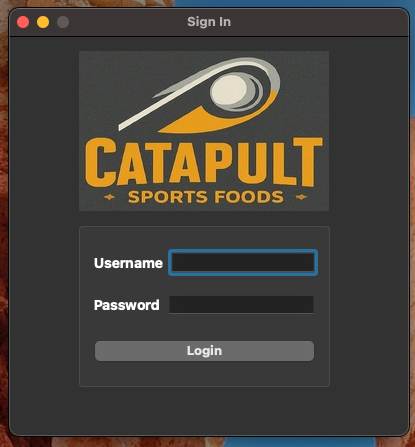
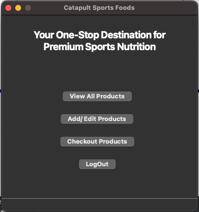
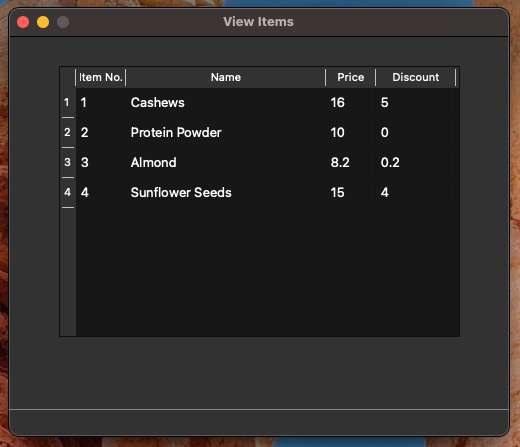
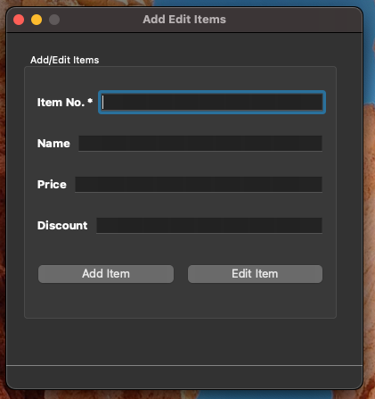
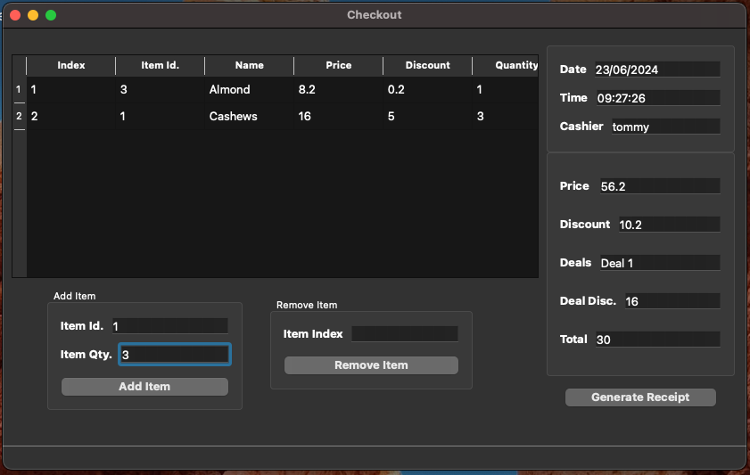
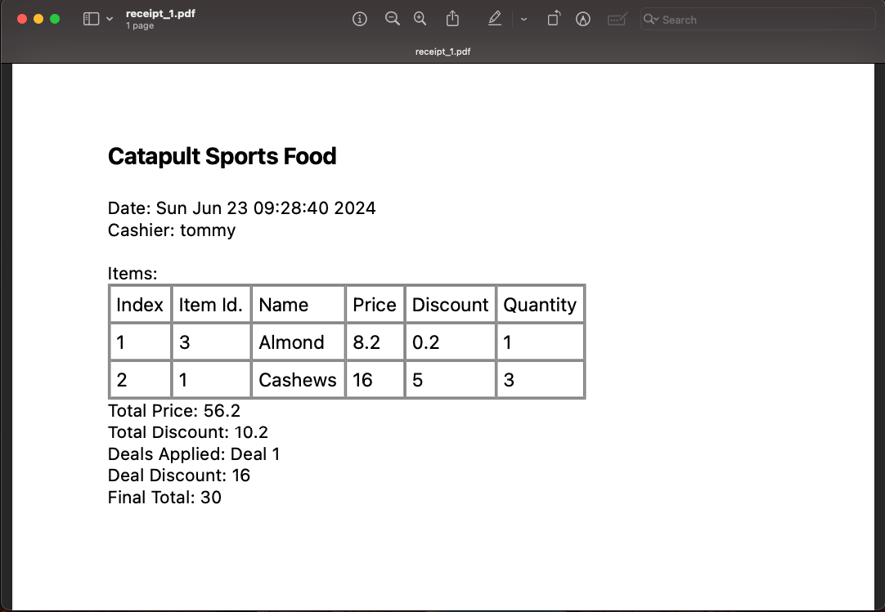

# Supermarket Checkout

This project implements a supermarket checkout system using Qt. The system allows users to add, edit, and view items in the database, and calculate the total price of items in the cart with discounts applied.

We have made use of Qt's GUI framework to create a user-friendly interface for the application. C++ is used for the backend logic, and SQLite is used as the database engine to store information about items and employees.

## Features

- Add new items to the database
- Edit existing items in the database
- View all items in the database
- Calculate total price with discounts applied
- Deals with the following discounts:
  - Deal 1: Buy 3 identical items and pay for 2
  - Deal 2: Buy 3 items (in a set of items) and get the cheapest one free
- Generate a pdf of the customer receipt showing item prices and grand total

## Dependencies

- Qt 5.15 or later
- SQLite (comes with Qt)

## Language

- C++
- SQL

## Why Qt?

Qt is a cross-platform application framework that is widely used for developing applications with a graphical user interface (GUI). It provides a comprehensive set of tools and libraries for developing applications that can run on multiple platforms, including Windows, macOS, Linux, Android, and iOS.

Qt is well-suited for developing desktop applications, mobile applications, embedded systems, and other types of applications that require a GUI. It provides a wide range of features and tools that make it easy to develop high-quality applications with a professional look and feel.

Alternatives to using Qt for developing C++ applications with a GUI include:

- GTK+: A cross-platform toolkit for creating graphical user interfaces.
- wxWidgets: A C++ library for developing cross-platform applications with a native look and feel.
- FLTK: A cross-platform C++ GUI toolkit for developing desktop applications.


# Why SQLite?

SQLite is a lightweight, serverless, self-contained, and zero-configuration SQL database engine. It is widely used in embedded systems, mobile applications, and other scenarios where a small, fast, and reliable database engine is required.

SQLite is well-suited for use in desktop applications, mobile applications, and other types of applications that require a local database. It provides a simple and easy-to-use API for interacting with the database, and it supports a wide range of SQL features, including transactions, indexes, and triggers.

## Installation

### Prerequisites

Before you can build the project, you need to install the following software:

- Qt 5.15 or later

You can download Qt from the official website: https://www.qt.io/download-dev

### Unpacking the Project

- Unpack the project files to a directory on your computer.

### Opening the Project

To open the project in Qt Creator, follow these steps:

1. Open Qt Creator.
2. Click on "Open Project" and select the project file (`supermarket.pro`).


## Building the Project

### Using Qt Creator

To build the project using Qt Creator, follow these steps:

1. Open Qt Creator.
2. Open the project file (`supermarket.pro`).
3. Click on the "Build" button to build the project.

## To run the project:

### Using Qt Creator

1. Build the project as described above.
2. Open the project in Qt Creator.
3. Click on the "Run" button to run the project.

## How to Use the Application

When you run the application, you will see the sign-in window.

### Sign In:

Use the SignInWindow to sign in to the system. Enter your username and password and click the Sign In button.



### Main Menu:

After signing in, you will see the main menu with options to View All Products, Add/Edit Products,Checkout Products and Logout.



### View All Products:

When you click the View All Products button, you will see a table showing all Products in the database.




### Add/Edit Products:

When you click the Add/Edit Products button, you will see a form where you can add new items to the database or edit existing items.




### Checkout Products:

When you click the Checkout Products button, you will see a form where you can add items to the cart and calculate the total price with discounts applied.



### Generate Receipt:

After adding items to the cart, you can click the Generate Receipt button to see the receipt showing item prices and grand total. A pdf of the receipt will be saved in your specified directory.



## To add more users:

To add more users, you can run the following SQL query in the SQLite database:

```sql
INSERT INTO employeeinfo (
                             eid,
                             first_name,
                             last_name,
                             username,
                             password
                         )
                         VALUES (
                             'eid',
                             'first_name',
                             'last_name',
                             'username',
                             'password'
                         );

```

The functionality of adding additional users is not implemented in the application, because a separate user management system is more appropriate for managing multiple users.

## Database Schema

The database schema for the application is as follows:

```sql
CREATE TABLE employeeinfo (
    eid        INTEGER PRIMARY KEY
                       NOT NULL
                       UNIQUE,
    first_name TEXT    NOT NULL,
    last_name  TEXT,
    username   TEXT    UNIQUE
                       NOT NULL,
    password   TEXT    NOT NULL
);

CREATE TABLE iteminfo (
    iid           INTEGER PRIMARY KEY
                          NOT NULL,
    item_name     TEXT    NOT NULL,
    item_cost     INTEGER NOT NULL,
    item_discount INTEGER DEFAULT (0.0) 
);
```

The `employeeinfo` table stores information about employees, including their employee ID, first name, last name, username, and password.

The `iteminfo` table stores information about items, including their item ID, name, cost, and discount.

## Sample Data

### Employees
eid | first_name | last_name | username | password
--- | ---------- | --------- | -------- | --------
1   | Tom        | Smith     | tommy    | homealone

## Deals

### Deal 1: Buy 3 identical items and pay for 2 - Currently applied to Item 1

### Deal 2: Buy 3 items (in a set of items) and get the cheapest one free - Currently applied to Item 3, and Item 4

## Video Demo

A video demo of the application is available on YouTube: [Supermarket Checkout System Demo](https://youtu.be/lOHTSBjowOo)

## Acknowledgments
- Qt documentation and examples
- SQLite documentation
- QT C++ GUI Tutorial Series by ProgrammingKnowledge on YouTube
- Stack Overflow Users for answering questions

## Other Projects made by me(Mohammed Sadath Hasan)

- Ticket Reselling Platform: A web-based ticket reselling platform using the MERN stack. Managed MongoDB implementation for data storage, created RESTful APIs for seamless integration with third-party providers, and crafted a user-friendly interface with real-time search and filtering capabilities. Repository Link: https://github.com/mshasan2/ticket-reselling-app

- Dungeon Runner: A Java-based game with both GUI and text-based gameplay options using Java Swing. Emphasized object-oriented design principles and the Model-View-Controller (MVC) architecture for modularity and scalability. Repository Link: https://github.com/mshasan2/Dungeon-Runner

- Face Mask Detector: An award-winning application with a GUI utilizing Deep Neural Networks (MobileNet Architecture) to identify face mask usage in real-time. Utilized Python, TensorFlow, Scikit-Learn, and Git for efficient development and version control. Repository Link: https://github.com/mshasan2/Face-Mask-Detector-with-GUI

- Additional Projects: My other project repositories which include full-stack application development, machine learning, and software automation projects. 
  - Repository Link 1: https://github.com/mshasan2/Projects
  - Repository Link 2: https://github.com/mshasan2/Fake-News-Classifier
  - Repository Link 3: https://github.com/mshasan2/Fetch_Rewards
  - Repository Link 4: https://github.com/mshasan2/Exploratory_Data_Analysis

My GitHub Repository Link to view all projects: https://github.com/mshasan2?tab=repositories

# Thank you for reading!


 

